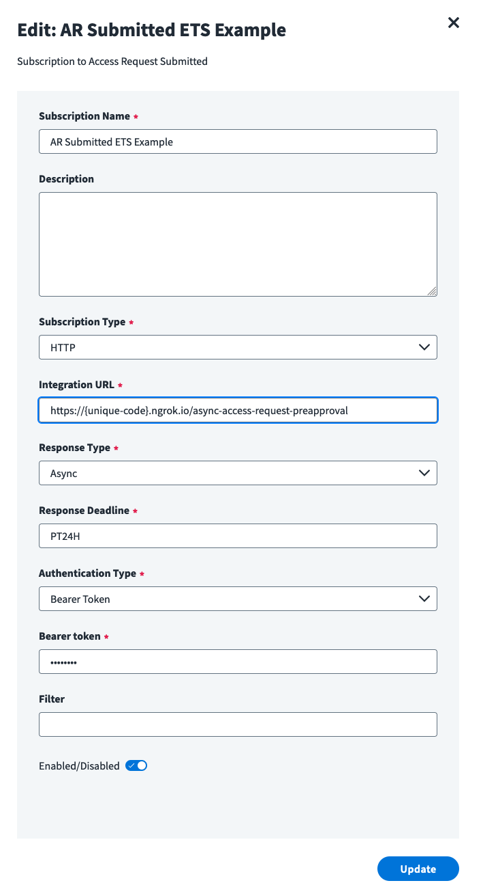

# Node.js Event Trigger Client

This folder contains an example event trigger client implemented as an express server in Node.js.  It provides code stubs to demonstrate how to process a `FIRE_AND_FORGET` trigger type, as well as how to process a `REQUEST_RESPONSE` trigger for the `sync`, `async`, and `dynamic` response modes.

## Setup

You will need to install the following software in order to use this application.

- [Node.js](https://nodejs.org/en/download/)
- [ngrok](https://ngrok.com/download) (for local testing)

Once you have Node.js installed, open this folder in your terminal and run the following command to install the packages needed to run this application.

```sh
npm install
```

Once the packages are installed, run the following command to start the server.

```sh
npm start
```

This should start the server at `localhost:8081`.

```text
$ pwd
/Users/Documents/event-trigger-examples/node-js

$ npm start

> node-js@1.0.0 start
> node index.js

Example app listening at http://:::8081
```

## Configuration

Start by creating a file called ".env" within the `node-js` folder.  This file is not included in this repository since it contains secrets, and comitting this file to your repository can expose secret credentials.  This file is included in the `.gitignore` file, so it won't be included in commits once you add it. 

```txt
$ pwd
/Users/colin.mckibben/Documents/github/event-trigger-examples/node-js

$ ls -la
drwxr-xr-x  10 colin.mckibben  952227198    320 Jun 21 13:50 .
drwxr-xr-x   6 colin.mckibben  952227198    192 Jun  1 14:55 ..
-rw-r--r--   1 colin.mckibben  952227198     47 Jun  2 10:42 .env
-rw-r--r--   1 colin.mckibben  952227198     17 Jun  2 10:42 .gitignore
-rw-r--r--   1 colin.mckibben  952227198   6416 Jun  9 10:05 README.md
drwxr-xr-x   2 colin.mckibben  952227198     64 Jun 21 13:50 images
-rw-r--r--   1 colin.mckibben  952227198   8052 Jun  7 15:46 index.js
drwxr-xr-x  67 colin.mckibben  952227198   2144 Jun  6 14:42 node_modules
-rw-r--r--   1 colin.mckibben  952227198  44080 Jun  6 14:42 package-lock.json
-rw-r--r--   1 colin.mckibben  952227198    363 Jun  6 14:41 package.json
```

This is an environment file that will hold secret configuration information needed by the server to run.  Within your ".env" file, provide a randomly generated string of characters in the `TOKEN` field to enable authentication on the server.

```text
TOKEN="R@ndomStr1ng0fCh@r&ct3rs"
```

When subscribing to an event trigger in the IDN UI, set the **Authentication Type** to **Bearer Token** and paste your token into the `Bearer token` text box.  This will instruct IDN to send your secret token along with each event that the trigger generates.  This example app has an authentication function that will check each event received by IDN has the correct token before processing the request.



> Note: Event trigger subscribers don't need to implement authentication, and the authentication logic in this example app can be removed if desired.  However, it is best practice to perform authentication since your subscriber will be public to the internet and you want to ensure that you only process requests that are sent by an authorized service.

## Testing Locally

To test the trigger client, make sure the server is running and then send a POST request to one of the configured endpoints in `index.js`.  You can use the following cURL command to test the client.

```sh
curl --location --request POST 'localhost:8081/identity-attributes-changed' --header 'Content-Type: application/json' --data-raw '{"data": "hello world!"}'
```

The client should respond with a 200 (OK) and an empty request body.  The request body you sent should be logged in the terminal window.

## Testing Using ngrok

[ngrok](https://ngrok.com/) is a tool that allows you to easily tunnel web traffic to your computer as if it were a public web server.  This tool makes it extremely easy to test your client service on your local machine while using live event data from IdentityNow.  Generally speaking, this tool is safe to use for testing purposes, but please consult your network team first to make sure it is acceptable to use within your company's network.  You may need to engage your network team if the [corporate firewall blocks web tunneling](https://ngrok.com/docs/guides/running-behind-firewalls) tools like ngrok to make an exception for your use case.

If you have ngrok installed, run the following command to start a tunnel to the port that your client service is running on.

```sh
ngrok http 8081
```

If ngrok successfully connects, you should see a forwarding IP address that you can use when subscribing to an event trigger in IDN.

```text
ngrok                                                                                                                               (Ctrl+C to quit)
                                                                                                                                                    
Session Status                online                                                                                                                
Account                       John Doe (Plan: Free)                                                                                           
Update                        update available (version 3.0.4, Ctrl-U to update)                                                                    
Version                       3.0.3                                                                                                                 
Region                        United States (us)                                                                                                    
Latency                       42.401835ms                                                                                                           
Web Interface                 http://127.0.0.1:4040                                                                                                 
Forwarding                    https://23bf-55-55-55-555.ngrok.io -> http://localhost:8081                                                           
                                                                                                                                                    
Connections                   ttl     opn     rt1     rt5     p50     p90                                                                           
                              0       0       0.00    0.00    0.00    0.00      
```

This output shows us that any request sent to `https://23bf-55-55-55-555.ngrok.io` will be redirected to your server running at `localhost:8081`.  You can try this for yourself by running the following cURL command, replacing the hostname with the one provided to you by ngrok.

```sh
curl --location --request POST 'https://23bf-55-55-55-555.ngrok.io/identity-attributes-changed' --header 'Content-Type: application/json' --data-raw '{"data": "hello world!"}'
```

Now you can configure a trigger subscription in IDN to use this public IP address to send live event trigger data directly to your local machine for testing purposes.  Just paste one of the configured URLs exposed by this server into the **Integration URL** text box when subscribing to a trigger.  The following endpoints are included out-of-the-box with this example app:

- `/identity-attributes-changed` - Processes `FIRE_AND_FORGET` type event triggers.  The name of the endpoint can be changed if you want to use a different trigger.
- `/sync-access-request-preapproval` - Processes `REQUEST_RESPONSE` type event triggers configured for **synchronous** mode.
- `/async-access-request-preapproval` - Processes `REQUEST_RESPONSE` type event triggers configured for **asynchronous** mode.
- `/dynamic-access-request-preapproval` - Processes `REQUEST_RESPONSE` type event triggers configured for **dynamic** mode.

For example, to configure an [Access Request Submitted](https://developer.sailpoint.com/triggers/available-event-triggers/Access_Request_Preapproval.html#getting-started) trigger to send events to this service's ngrok endpoint using **async** mode, use the following configuration options.


> Note: ngrok will generate a random URL each time it is started.  You will need to update your trigger subscription with the new URL generated by ngrok each time you run it.
